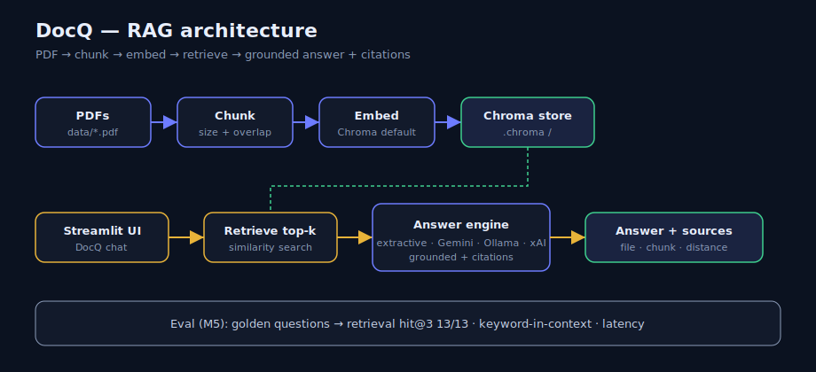

# RAG Document Q&A (`rag-doc-qa`)

[](./MILESTONES.md)
[](https://www.python.org/)
[](https://streamlit.io)
[](./eval/last_results.json)
[](./docs/DEPLOY.md)

Ask questions over **your PDFs** in a **browser chat**. The app retrieves relevant chunks, answers with an LLM **only from that context**, shows **citations**, and includes a **measured eval set**.

**Author:** [Nilima Satapathy](https://github.com/nilima-satapathy) · Progress: **[ai-career-journey](https://github.com/nilima-satapathy/ai-career-journey)**

| | |
|---|---|
| **Status** | **M1–M6 ready** — public deploy guide + architecture diagram |
| **Live demo** | *Deploy once → paste URL here* (see [docs/DEPLOY.md](./docs/DEPLOY.md)) |
| **Stack** | Python · pypdf · Chroma · Streamlit · Gemini / Extractive / Ollama / xAI |
| **Releases** | [tags](https://github.com/nilima-satapathy/rag-doc-qa/releases) |

---

## Live demo

1. Follow **[Deploy on Streamlit Community Cloud](./docs/DEPLOY.md)** (~5 minutes).
2. After the app is live, update this section with your URL, for example:

```text
https://YOUR-APP-NAME.streamlit.app
```

Default answer mode is **extractive** (no API key). Optional free Gemini via Streamlit secrets.

---

## Architecture



```text
PDF → chunks (M1) → Chroma search (M2) → Answer + citations (M3)
                                              ↓
                                    Streamlit chat UI (M4)
                                              ↓
                                    Eval hit@3 (M5) → Public deploy (M6)
```

Details: [diagrams/architecture.md](./diagrams/architecture.md)

**Cold start:** the app **auto-builds** the Chroma index from `data/*.pdf` if the store is empty (required for Cloud; `.chroma/` is not committed).

---

## Evaluation (M5) — portfolio signal

Golden set: **`eval/questions.json`** (14 cases: 13 in-corpus + 1 out-of-scope).

```powershell
python scripts/build_index.py
python eval/run_eval.py --top-k 3
# optional (needs API credits):
# python eval/run_eval.py --with-llm
```

### Latest local results

| Metric | Result |
|--------|--------|
| # docs indexed | 3 PDFs → 6 chunks |
| # eval questions (scored) | 13 in-corpus (+ 1 negative skipped for doc-hit) |
| **Retrieval hit-rate@3** | **13/13 (100%)** |
| Keyword-in-context | 13/13 (100%) |
| Avg retrieval latency | ~292 ms |
| Known limits | Small corpus; out-of-scope still returns nearest chunks (LLM “I don’t know” uses distance + prompt) |

Snapshot: [`eval/last_results.json`](./eval/last_results.json)

**What hit-rate@3 means:** for each question with an expected PDF, that file appears in the **top 3** retrieved sources.

---

## Quick start — local

```powershell
cd Desktop\Code\rag-doc-qa
python -m venv .venv
.\.venv\Scripts\Activate.ps1
pip install -r requirements.txt
python scripts/generate_sample_pdfs.py
python scripts/build_index.py

# Optional .env — see .env.example (default: extractive, free)
streamlit run app.py
```

Browser: **http://localhost:8501**

---

## Deploy (M6)

| Step | Action |
|------|--------|
| 1 | Push `main` to GitHub (this repo) |
| 2 | [share.streamlit.io](https://share.streamlit.io) → **New app** |
| 3 | Repo `nilima-satapathy/rag-doc-qa`, branch `main`, file `app.py` |
| 4 | Deploy · optional secrets in [docs/DEPLOY.md](./docs/DEPLOY.md) |
| 5 | Paste public URL into this README |

---

## CLI

```powershell
python scripts/run_m1_chunk.py
python scripts/build_index.py
python scripts/run_m2_search.py "What is RAG?"
python scripts/run_m3_ask.py "What timeout does ApiClient use?"
python eval/run_eval.py
```

---

## Project layout

```text
rag-doc-qa/
├── app.py                 # Streamlit DocQ UI (Cloud entrypoint)
├── data/                  # sample PDFs
├── diagrams/              # architecture (M6)
├── docs/DEPLOY.md         # Streamlit Cloud steps
├── eval/
│   ├── questions.json
│   ├── run_eval.py
│   └── last_results.json
├── scripts/
├── src/
│   ├── config.py          # env + Streamlit secrets
│   ├── ingest.py
│   ├── retrieve.py        # index + ensure_index (auto cold start)
│   ├── generate.py
│   ├── llm_client.py
│   └── ui_theme.py
├── .streamlit/config.toml
├── requirements.txt
└── runtime.txt            # Python 3.11 on Cloud
```

---

## Answer modes

| Mode | Cost | Needs |
|------|------|--------|
| **extractive** | Free | Nothing (default) |
| **gemini** | Free tier | `GEMINI_API_KEY` |
| **ollama** | Free | Local Ollama |
| **xai** | Paid credits | `XAI_API_KEY` |

---

## Milestones

See **[MILESTONES.md](./MILESTONES.md)** — M1–M5 complete; M6 deploy assets shipped (mark live URL after Cloud publish).

---

*Project 3 of [ai-career-journey](https://github.com/nilima-satapathy/ai-career-journey)*
