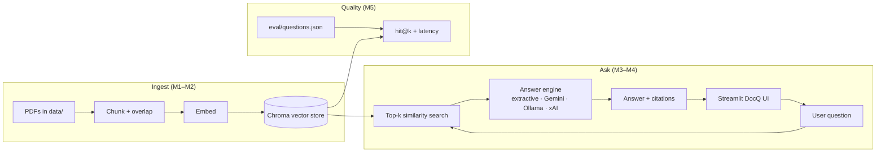

# DocQ architecture

## Request path (happy path)

1. User opens DocQ (local or Streamlit Cloud).
2. App **auto-builds** the Chroma index from `data/*.pdf` if empty (deploy cold start).
3. Question → embed → top‑k chunks from Chroma.
4. Answer engine:
   - **extractive** (default free) — best matching PDF passages
   - **gemini / ollama / xai** — grounded generation with citations
5. UI shows answer + source file / chunk / distance.

## Components

| Layer | Module | Role |
|-------|--------|------|
| UI | `app.py`, `src/ui_theme.py` | Chat, settings, themes |
| Ingest | `src/ingest.py` | PDF load + chunk |
| Retrieve | `src/retrieve.py` | Chroma index + search |
| Generate | `src/generate.py`, `src/llm_client.py` | Grounded answer + citations |
| Config | `src/config.py` | Env + Streamlit secrets |
| Eval | `eval/run_eval.py` | Retrieval hit-rate@k |
